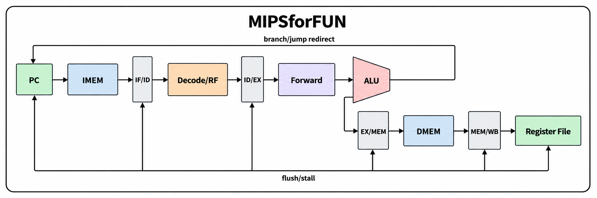

# MIPSforFUN

**A fully pipelined 32-bit MIPS-style CPU in SystemVerilog, with a C ISA reference model and C assembler.**

MIPSforFUN is designed as a readable computer-architecture project: the RTL is split into the classic five stages, hazards are handled explicitly, and the included program deliberately exercises forwarding, a load-use stall, branches, jumps, `jal`, and `jr`.

## Architecture

<p align="center">
  
</p>

MIPSforFUN follows the classic **five-stage MIPS pipeline**: instruction fetch, decode/register read, execute, memory access, and writeback. The datapath includes forwarding, load-use stalling, and branch/jump redirection with pipeline flushing.

### Five pipeline stages

- **IF** — instruction fetch, `PC+4`
- **ID** — decode, register read, immediate extension, load-use hazard detection
- **EX** — operand forwarding, ALU, branch/jump resolution
- **MEM** — data-memory read/write
- **WB** — ALU/load/link writeback

### Hazard support

- EX/MEM → EX forwarding
- MEM/WB → EX forwarding
- Store-data forwarding
- Branch-operand forwarding
- One-cycle load-use interlock
- IF/ID + ID/EX flush on taken branch or jump
- `$zero` write suppression

### ISA subset

`add addu sub subu and or xor slt sltu sll srl sra jr`

`addi addiu slti andi ori xori lui`

`lw sw beq bne j jal`

The instruction encodings are standard MIPS encodings. MIPSforFUN uses **no branch delay slot**; consequently `jal` links `PC+4`.

## Repository layout

```text
MIPSforFUN/
├── mipsforfun.jpg
├── rtl/
│   ├── mipsforfun_pkg.sv
│   ├── alu.sv
│   ├── regfile.sv
│   ├── control.sv
│   ├── hazard_unit.sv
│   ├── forward_unit.sv
│   ├── cpu.sv
│   ├── memory.sv
│   └── soc.sv
├── sim/
│   └── tb_MIPSforFUN.sv
├── ref/
│   ├── mips_ref.c
│   └── mips_pipeline_model.c
├── tools/
│   └── mipsasm.c
├── programs/
│   ├── pipeline_demo.asm
│   └── pipeline_demo.hex
├── docs/
│   └── ARCHITECTURE.md
└── Makefile
```

## Build the C tools

```bash
make
```

Run the sequential ISA reference model:

```bash
./build/mips_ref programs/pipeline_demo.hex
```


Run the cycle-accurate 5-stage C pipeline model:

```bash
./build/mips_pipeline_model programs/pipeline_demo.hex
```

Or run both C checks:

```bash
make test-c
```

Expected output includes:

```text
mem[0x100]=55
mem[0x104]=110
mem[0x108]=1
mem[0x10C]=165
```

Assemble the demo again:

```bash
./build/mipsasm programs/pipeline_demo.asm programs/pipeline_demo.hex
```

## Simulate the SystemVerilog CPU

With Icarus Verilog:

```bash
make sim
```

The testbench produces `mipsforfun.vcd` and stops with `PASS` after checking the expected memory values.

Example GTKWave use:

```bash
gtkwave mipsforfun.vcd
```

## Key RTL behavior

### Forwarding

For both EX source registers, priority is:

```text
EX/MEM ALU result > MEM/WB final result > ID/EX register value
```

A load in EX/MEM cannot forward its address as load data, so EX/MEM forwarding is suppressed when `mem_to_reg=1`. A dependent instruction is held one cycle and then receives the loaded value from MEM/WB.

### Branches and jumps

`beq`, `bne`, `j`, `jal`, and `jr` redirect the PC in EX. The two younger instructions are invalidated. The redirect has priority over an ID-stage stall.

### C reference model

`ref/mips_ref.c` is intentionally non-pipelined and defines the architectural result of each instruction. `ref/mips_pipeline_model.c` is a cycle-level software model of the same IF/ID/EX/MEM/WB organization, including forwarding, load-use stalls, WB-to-ID bypassing, and control flushing.

## Extending MIPSforFUN

Good next extensions are byte/halfword loads and stores, overflow/illegal-instruction exceptions, HI/LO multiply/divide, CP0/interrupts, caches, branch prediction, and a Verilator differential-testing harness that compares RTL retirement against the C model.

## License

Use this project freely for learning, coursework, and research prototypes. Add your preferred open-source license before publishing it as a public repository.
